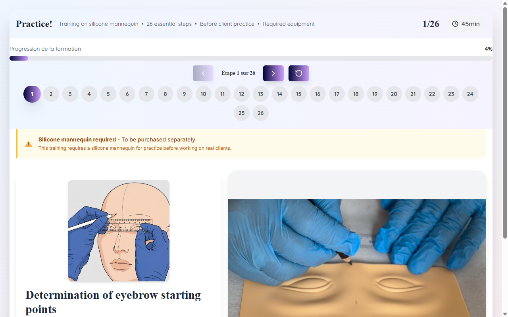

# Technique Avancée — Microblading EN Slide 16

**Course:** MICROBLADING (EN)  
**Slide:** 16  
**Live URL:** https://dfghjh-v38j.edtechiecorp.com  
**Stack:** Next.js · Tailwind CSS · TypeScript · GitHub Pages  

## What this slide does

Advanced technique content for the English microblading course, positioned near the end of the module where learners consolidate complex skills. Covers refined stroke techniques, troubleshooting common issues like patchy pigment retention, and best practices for achieving consistent, professional results across different skin types. At this stage in the course, learners are expected to have prior knowledge of the fundamentals.

## Screenshot

## Usage

This slide is embedded as an iframe inside Coassemble at the live URL above. DNS is managed via Cloudflare (`edtechiecorp.com`). To update the slide, push to the `main` branch — GitHub Actions will rebuild and redeploy automatically.
